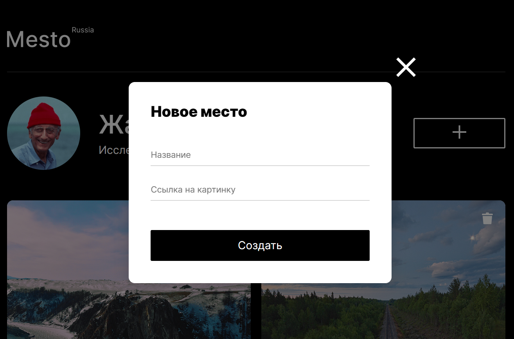
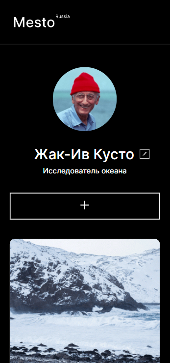
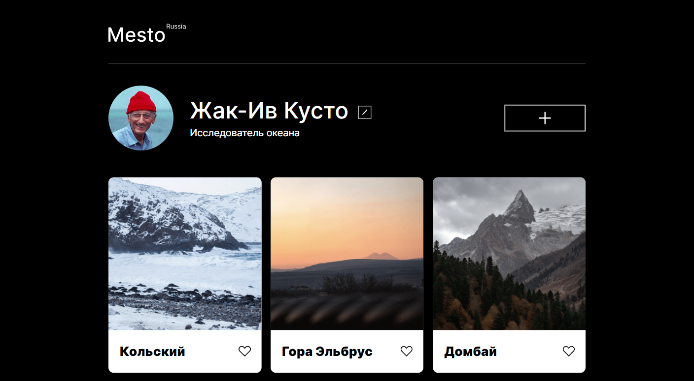

# Проект: Место

### Обзор
* Описание
* Структура с примерами оформления

**Описание**

Ссылка: **(https://Vitaliy23Nikolaenko.github.io/mesto/index.html)**
;

Одностраничный сайт от [**Яндекс.Практикум**](https://practicum.yandex.ru/) с графическим офрмлением, представляющий собой интерактивный сервис со следующими возможностями:
  * редактирование профиля через модальное окно;
  * валидация;
  * добавление/удаление публикаций;
  * проставление реакций;
  * откррытие фотографии в увеличенном размере.

**Структура с примерами оформления**

Сайт включает в себя следующие **секции**:

**1.** Шапка сайта (**header**) с логотипом.

**2.** Секция **profile** с описанием профиля и возможностью его редактирования через всплывающее модальное окно c валидацией, а также кнопка для добавления контента страницы через всплывающее модальное окно.




**3.** Секция **places** с возможностью добавления публикаций, в которых содержатся фотография локации, название, кнопка реакции(лайк) и кнопка удаления публикации. Реализована возможность просмотра увеличенного изображения из публикации в всплывающем модальном окне.


Применена адаптивная верстка для дисплеев с разрешением от 320px до 1280px.

**320px**

;

**1280px**

;

Применен объектно-ориентированный подход разработки:
* используются классы - каждый класс описан в отдельном файле и импортирован в главный index.js;
* использована слабая связь между классами.

Проект выполнен с помощью **HTML**,**СSS** и **JavaScript(ES6)**.

```
<div class="popup">
        <form class="popup__container">
          <h2 class="popup__title">Редактировать профиль</h2>
          <input type="text" class="popup__edit-title" />
          <input type="text" class="popup__edit-description" />
          <button type="submit" class="popup__submit-button">Сохранить</button>
          <button type="button" class="popup__close-button">
            
          </button>
        </form>
        <div class="popup__overlay"></div>
      </div>
```
```
import UserInfo from '../components/UserInfo.js';

const userInfo = new UserInfo({ // Создаем экземпляр класса UserInfo с соответствующими селекторами из HTML
  userNameSelector: '.profile__name',
  userDescriptionSelector: '.profile__description',
});

const createNewPlace = (data) => { // Создаем функцию для колбека в экземплярах Section и PopupWithForm (для создания карточки)
  const place = new Card(data, '#placeTemplate', {
    handlePlaceClick: () => {
      popupImage.open(data);
    },
  });

  return place.createPlace();
};

const placeList = new Section( // Создаем экземпляр класса Section
  {
    items: initialCards,
    renderer: (data) => {
      placeList.addItem(createNewPlace(data));
    },
  },
  '.place-gallery'
);

```